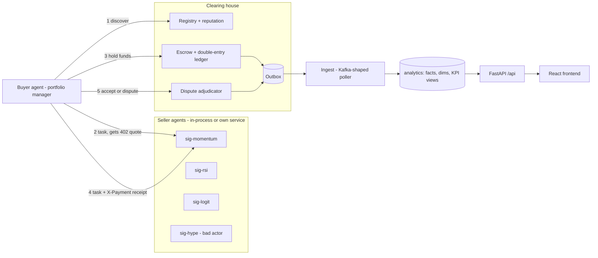

# AgentLedger 360

**An agent-to-agent market for market intelligence, with an auditable ledger and a Customer 360 warehouse.**

A portfolio-manager agent needs 5-day direction signals for a few stocks. It **discovers** competing
seller agents (A2A-style agent cards), gets a priced quote through **HTTP 402 Payment Required**,
locks the money in **escrow** at a clearing house, receives the data, **verifies** it against
machine-checkable contract terms (schema, freshness, point-in-time, backtested hit rate and rank IC),
then **settles** or opens a **dispute** that a deterministic adjudicator resolves by re-running the checks.
Seller **reputation** moves with every outcome, so the market learns to avoid the cheap bad actor.
Every state change goes through a transactional **outbox** into an event-sourced **analytics warehouse**
(Customer 360, agent reliability, RFM segments, data-quality and reconciliation checks).

> Design rule: LLM agents decide *what to do*; deterministic tools and policy decide *whether money may move*.
> All money is simulated, in integer minor units.

**System model:** `docs/opm/` (OPM diagram in DOT, rendered SVGs, OPL guide). Agents start at `AGENTS.md`.

## Real AI agents (and what they cost)

Two LangGraph agents (plan -> tool loop under budget -> reflect, the pattern from
[revio](https://github.com/witold-andelie/revio)) do the work, on Mistral by default (Claude or any
OpenAI-compatible endpoint via `AL_LLM_PROVIDER`):

| Agent | Tools | What it decides | Guardrail |
|---|---|---|---|
| Buyer (`agents/buyer_agent.py`) | check_wallet, search_sellers, request_quote, buy, verify_delivery, accept_delivery, open_dispute | which seller, when to retry, accept or dispute | tools refuse unverified accepts, failed-check accepts, >2 buys per symbol, hash mismatches |
| Guardian (`agents/guardian.py`) | get_case, check_evidence_hash, rerun_acceptance_checks, seller/buyer_track_record, policy_bounds, submit_ruling | refund % inside the policy band, with cited checks | `disputes.validate` rejects out-of-band or ungrounded rulings; rule table is the fallback |

Every LLM call is metered (input/output tokens, integer micro-USD, price source) and capped per run
(`AL_AGENT_MAX_TOOL_CALLS`, `AL_AGENT_MAX_COST_USD`). Traces stream live at `/api/agent/rounds/{job_id}` and land
in the warehouse as `llm.usage` / `agent.run.finished` events -> `v_ai_cost_by_agent`, `v_ai_cost_by_model`.
Measured on 2026-10-08 with `mistral-medium-latest`: one round about **$0.09** (buyer 19 LLM calls / 46k tokens
$0.075, guardian about $0.007 per dispute). Mistral Medium/Small prices come from third-party trackers;
verify on your Mistral billing page or set `AL_LLM_PRICE_IN/OUT`. Without a key the system runs the rule-based agents.

## Architecture



## Quickstart (one laptop)

```bash
uv venv .venv --python 3.13                     # or 3.11 - both are supported and tested
uv pip install --python .venv -e ".[dev,ml]"
python -m agentledger.demo --reset              # CLI end-to-end demo, everything in-process
python -m pytest
uvicorn agentledger.server:create_app --factory --port 8000    # API; serves frontend/dist when built
cd frontend && npm install && npm run dev       # React dev server on :5173 (proxies /api to :8000)
```

## Two laptops (real network calls between agents)

Both machines must share `AL_PAYMENT_SECRET` (sellers verify receipts signed by the clearing house).

```bash
# Laptop B - seller agents only
AL_ROLE=sellers AL_SELLER_PUBLIC_URL=http://<B-ip>:8002 \
  uvicorn agentledger.server:create_app --factory --host 0.0.0.0 --port 8002
# Laptop A - clearing house + API + buyer, using B's sellers
AL_SELLER_URL=http://<B-ip>:8002 uvicorn agentledger.server:create_app --factory --port 8000
```
PowerShell: `$env:AL_ROLE="sellers"; $env:AL_SELLER_PUBLIC_URL="http://<B-ip>:8002"; uvicorn ...`.
Allow the port through Windows Firewall on laptop B.

## Deploy on Render

`render.yaml` is a Blueprint (Docker runtime, free plan, Frankfurt): Render dashboard -> New -> Blueprint.
Service `agentledger` works alone (sellers in-process). The optional `agentledger-sellers` service runs the
same image with `AL_ROLE=sellers`; point `AL_SELLER_URL` at it to make agents pay each other over the internet.
Free instances sleep after ~15 min: open `/api/health` before presenting. SQLite resets on every deploy.

## Repository map

| Path | What |
|---|---|
| `src/agentledger/contracts.py` | frozen wire contracts shared by both halves |
| `src/agentledger/economy/` | ledger, escrow/order state machine, disputes, registry, receipts |
| `src/agentledger/sellers/` | seller catalog + HTTP 402 paywall service |
| `src/agentledger/agents/` | buyer agent (survival tiers), optional Claude layer |
| `src/agentledger/market/` | prices, features, signals, backtest, acceptance checks |
| `src/agentledger/analytics/` + `sql/` | outbox ingest, marts, KPI views, data-quality checks, DAG runner |
| `src/agentledger/server.py` | web entry point (`/api`, `/platform`, `/sellers`, static frontend) |
| `frontend/` | React + Vite skeleton; rules in `docs/FRONTEND_RULES.md` |
| `docs/opm/` | OPM model (DOT + SVG) and OPL guide |
| `docs/TEAM_PLAN.md` | half-day plan, split of work, demo script |

## Where the ideas come from

| Area | Module | Idea source |
|---|---|---|
| Prices, features, models, backtest | `market/` | DataTalksClub stock-markets-analytics-zoomcamp M1-M4 |
| RSI mean-reversion seller | `market/signals.py` | author's zoomcamp homework 2 (RSI < 30 entries) |
| Hit rate + rank IC acceptance terms | `market/backtest.py` | IC / RankIC in alpha-mining repos (gplearn family, quant-alpha-foundation) |
| Point-in-time check, analyst roles | `market/quality.py`, `market/signals.py` | TradingAgents |
| Buyer survival tiers | `agents/buyer.py` | Conway-Research/automaton |
| Agent cards + `/SKILL.md` onboarding | `sellers/app.py` | HKUDS/AI-Trader agent onboarding |
| RFM segmentation view | `sql/002_analytics.sql` | golden_dragon_prague analytics views |
| Evidence hashes, reconciliation checks | `economy/disputes.py`, `sql/quality_checks.sql` | PerpPulse |
| Scripted DAG + run log | `analytics/pipeline.py` | zoomcamp M5, Bruin-style topological runner |
| Frontend stack and Render deploy | `frontend/`, `Dockerfile`, `render.yaml` | EuroGoal football predictor |

## Python 3.11 and 3.13

`requires-python = ">=3.11,<3.14"`; Ruff `target-version = "py311"`; `scripts/check_compat.ps1|.sh` and the CI
matrix run the suite on both. Rules: no PEP 695 syntax, no `sqlite3.connect(autocommit=...)`, no
`itertools.batched` / `typing.override`, ISO-string timestamps in SQLite, `zlib.crc32` (not `hash()`) for seeds.

## Honest limits

Simulated money; HMAC receipts (shared secret) instead of asymmetric signatures; delivery hashes are seller-signed
HMAC (per-seller key derived from the shared secret); SQLite instead of PostgreSQL/Kafka/Airflow (the outbox, cursor and DAG
keep the same contracts so they can be swapped). No integration with any SAP product is claimed.
